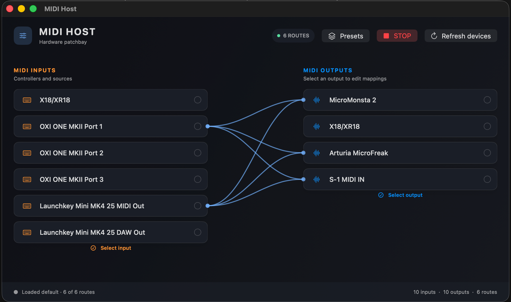

# MIDI Host

A native macOS MIDI patchbay generated completely using AI for routing hardware controllers to one or more synthesizers. It uses SwiftUI and CoreMIDI and is designed for a simple, visual hardware setup.



## Features

- Discovers connected CoreMIDI inputs and outputs.
- Shows only the devices selected with the **Select input** and **Select output** controls.
- Connects inputs to outputs by dragging a cable between the device cards.
- Supports one-to-many routing, so a controller can feed multiple synthesizers.
- Edits each output’s mapped inputs in an output popover.
- Filters an input by MIDI channel and remaps it to a different output channel.
- Shows route-specific MIDI activity at the cable endpoints.
- Saves named routing presets, including selected devices and channel settings.
- Loads a chosen startup preset when the app launches.
- Supports renaming, overwriting, loading, and deleting presets.
- Provides an emergency **STOP** command that sends All Notes Off, All Sound Off, Reset Controllers, MIDI Stop, and explicit Note Off messages to every detected output.

## Run

Open the folder in Xcode and run the `MIDIHost` executable target, or use:

```sh
./run.sh
```

To create a double-clickable personal-use app bundle:

```sh
./package_app.sh
```

This creates `MIDIHost.app` in the project folder. You can double-click it in Finder or drag it to `/Applications`.

The app currently targets Apple Silicon Macs (`arm64`) running macOS 11 or later. It uses only SwiftUI and CoreMIDI. Intel Mac support is not included in the current build.

## Basic workflow

1. Connect the MIDI hardware and click **Refresh devices**.
2. Use **Select input** and **Select output** to choose which devices appear on the main canvas.
3. Drag an input card onto an output card to create a route.
4. Click an output card to change the input and output MIDI channels for each mapping.
5. Open **Presets** to save the setup, update an existing preset, rename it, or make it the startup preset.

The current version intentionally focuses on hardware routing. Transpose, MIDI clock, a full MIDI monitor, and menu-bar mode are not implemented yet.

## Project layout

- `Sources/MIDIHost/MIDIHostApp.swift` — application and CoreMIDI routing logic.
- `Resources/AppIcon.svg` and `Resources/MIDIHost.icns` — application icon assets.
- `package_app.sh` — builds and signs the double-clickable app bundle for personal use.

## Release compatibility

The downloadable app in the current release is built for Apple Silicon only.
